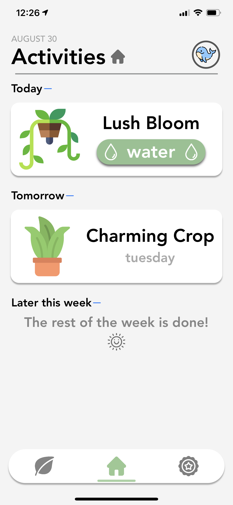
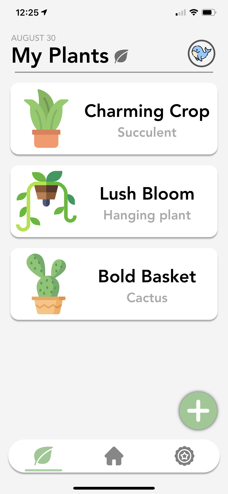
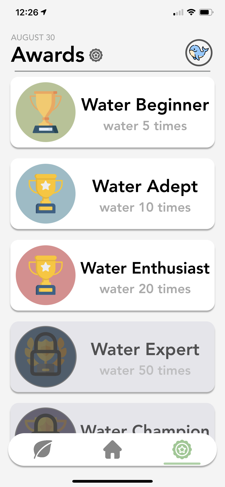
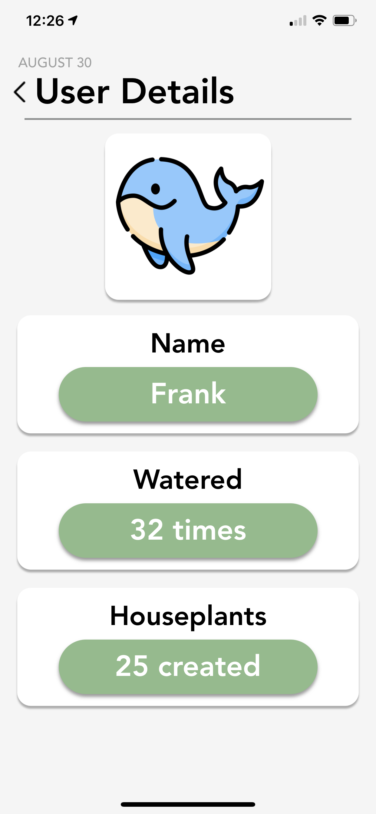

# HousePlant-Tracker-Privacy-Page
Hi!

This github repository contains the html code for the privacy noticy for the app HousePlant Tracker. This same code is being hosted by githubpages and linked right on the project's App Store page. HousePlant Tracker is an iOS app used to keep track of your plants' watering schedule.

# HousePlant

This is the repository for a proyect I'm working on, an iOS app which helps keep track of your house plants watering schedule.

# Motivation #

The motivation behind this project is to make owning a houseplant an easy process in which you can be sure you'll never forget to take care of it.

# Screenshots #

  
 

# Framework used #

**Built with**
* Swift UIKit
* TestFlight

# How to use? #

* This project **can be found on the App Store**, with some great new features that ir currently in progress.

# Credits #

* Software dev and design done me.
